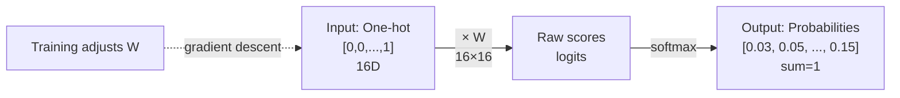
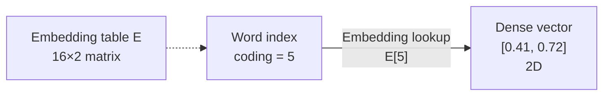
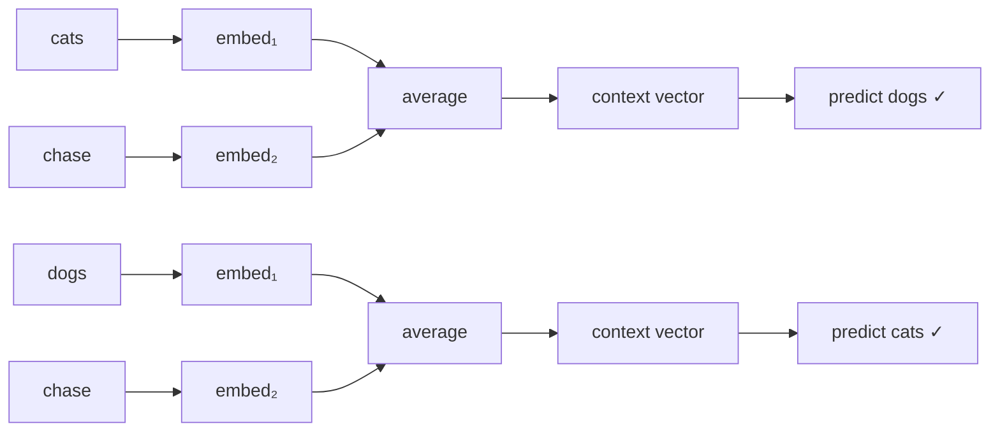
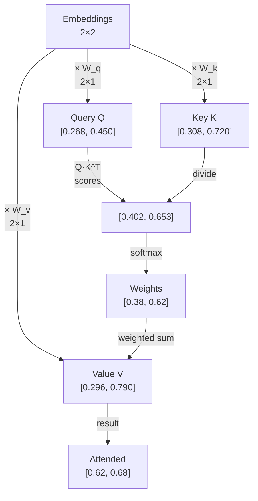
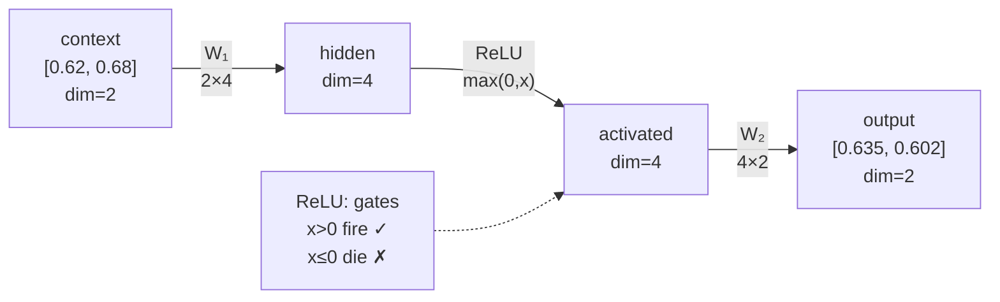
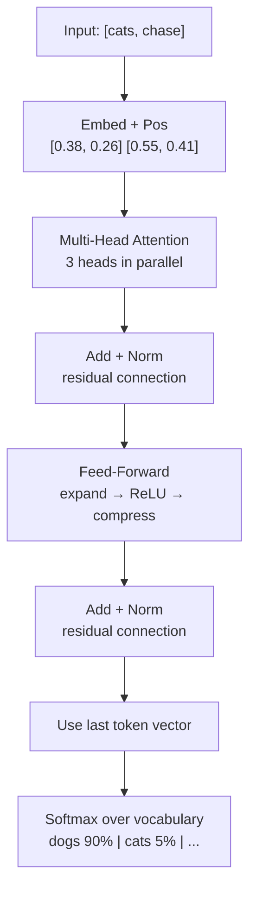

# The Evolution of Next-Word Prediction: From Count to Transformer

**From word counting to transformers: a programmer's journey into how machines predict language.**

Imagine teaching a computer to autocomplete sentences. You start simple—count which words follow each other—but the patterns are confusing. You need the computer to *learn* instead of just count. So you add a neural network. Then word embeddings. Then attention. Each breakthrough solves a specific problem until you've built a small transformer.

This is that journey, one piece at a time, on a small dataset that shows exactly why each piece matters.

**Want a quick overview of all files?** → See [FILES.md](FILES.md) for a complete table of contents.

---

## The Training Data

A carefully crafted 12-sentence dataset that exhibits the puzzles a real language model must solve:

```
i love ai           |  dogs are loyal
i love coding       |  cats are cute  
i hate bugs         |  coding is fun
cats chase dogs     |  coding is hard
dogs chase cats     |  ai is fun
                    |  ai is great
```

**The challenges**: Ambiguous predictions (`"chase"` → `"dogs"` or `"cats"`?), multiple valid completions (`"is"` → `"fun"`, `"hard"`, or `"great"`?), word order reversals (`"cats chase dogs"` ≠ `"dogs chase cats"`), and similar words in similar contexts (`"ai"` and `"coding"` are interchangeable).

**The goal**: Predict the next word. A simple input-output task that requires everything a real language model does.

---

## Step 1: Convert Text to Numbers

Computers work with numbers, not words. Create a vocabulary dictionary:

```python
vocab = ['ai', 'are', 'bugs', 'cats', 'chase', 'coding', 'cute', 'dogs',
         'fun', 'great', 'hard', 'hate', 'i', 'is', 'love', 'loyal']
word_to_index = {word: i for i, word in enumerate(vocab)}  # 'love' → 14
```

**The first approach: count word pairs.** Given `"i"`, always predict `"love"` because it follows 2/3 times. But this is rigid—it can't handle ambiguity (`"is"` → 50% `"fun"`, 25% `"hard"`, 25% `"great"`), and it doesn't *learn*.

What you need: a system that **adjusts** predictions based on examples. That's a neural network.

📄 [foundations.py](foundations.py)

---

## Step 2: Neural Networks Learn (Not Just Count)

**The problem:** Counting is rigid. You need a system that can *learn* (adjust predictions) based on examples.

**The solution:** Use a **neural network** (machine learning model that learns) with **learnable weights** (numbers that change during training). Represent each word as a **one-hot vector** (a list with one 1 and rest zeros):

**Step 2a: One-Hot Encoding**
```
Word "i" at position 12 in vocabulary:
Index: 0    1    2   ...  12   ... 15
       [0,  0,   0,  ..., 1,   ... 0]   ← only position 12 is 1, rest are 0
       
This is a 16-dimensional vector (one number for each word in vocabulary)
```

**Step 2b: Multiply by Weights**
```
Take the one-hot vector → multiply by weight matrix → get predictions
One-hot selects one row from the matrix (the row for word "i")

Example: if one-hot has 1 at position 12:
Selected row: [0.1, 0.2, 0.3, 0.1, 0.5, 0.2, 0.4, 0.1, ..., 0.6]
These are scores (predictions) for each word
```

**Step 2c: Convert to Probabilities**
```
Raw scores: [0.1, 0.2, 0.3, ...]  ← some negative, unbalanced
Softmax:    [0.03, 0.05, ...] ← all positive, sum to 1.0
This is a probability distribution (represents confidence for each word)
```


    
**The limitation:** One-hot vectors are huge (16D) and sparse. `"ai"` and `"coding"` both follow `"love"` and precede `"is"`, but one-hot treats them as completely different. Plus, the model sees only **one word at a time**—it can't distinguish `"i love ___"` from `"cats love ___"`.

📄 [neural_network.py](neural_network.py)

---

## Step 3: Embeddings (Dense Word Representations)

**The problem:** One-hot vectors are huge and wasteful. Also, `"ai"` and `"coding"` work the same way in our data, but one-hot treats them as completely different.

**The solution:** Replace one-hot with a small **embedding vector** (a compact list of numbers) per word. Words that behave similarly get similar embeddings.

**Step 3a: One-Hot vs Embedding**
```
One-hot "ai":   [0, 1, 0, 0, 0, 0, 0, 0, 0, 0, 0, 0, 0, 0, 0, 0]  (16 numbers, mostly zeros)
Embedding "ai": [0.45, 0.67]                                        (2 numbers, both useful)

One-hot "coding": [0, 0, 0, 0, 0, 1, 0, 0, 0, 0, 0, 0, 0, 0, 0, 0]  (completely different!)
Embedding "coding": [0.41, 0.72]                                     (very similar to "ai")
```

**Step 3b: Embedding Table Lookup**
```
Vocabulary words with their embeddings:
ai       → [0.45,  0.67]
are      → [0.12,  0.34]
bugs     → [-0.23, 0.55]
cats     → [-0.33, 0.28]  ← similar to dogs
...
coding   → [0.41,  0.72]  ← similar to "ai"
...
dogs     → [-0.30, 0.31]  ← similar to cats

To get embedding for "coding": just look it up → [0.41, 0.72]
```



Words in similar contexts automatically develop similar embeddings.

**The limitation:** Still processing **one word at a time**. `"love"` produces the same prediction whether it's `"i love ___"` or `"coding love ___"`. You need multiple words to disambiguate context.

📄 [embeddings.py](embeddings.py)

---

## Step 4: Context Windows (See Multiple Words)

**The problem:** A single word is ambiguous. You need context to disambiguate.

**The solution:** Process a **window** of previous words, averaging them into a single context vector:



Now the model can tell the difference! Order matters.

**The limitation:** Averaging weights all words equally. In `["cats", "chase"]`, the verb `"chase"` is the key signal, but it gets the same weight as `"cats"`. Some words matter more than others—you need **selective attention**.

📄 [context.py](context.py)

---

## Step 5: Attention (Weighted Context)

**The problem:** Averaging gives equal weight to all words. But some words are more important than others.

**The solution:** **Attention** (focusing mechanism) — calculate how much each word should focus on (attend to) every other word.

**Step 5a: The Three Transformations**
```
For each word embedding, create three versions:
- Query:  "What am I looking for?"
- Key:    "What do I contain?"  
- Value:  "What information do I have?"

These are just different views (projections [mathematical views]) of the same embedding
```

**Step 5b: Calculate Similarity (Attention Scores)**
```
Word "cats" looking at word "chase":
cats_query · chase_key = similarity score

Higher score = "cats" should pay more attention to "chase"
Lower score = "cats" should pay less attention to "chase"

Example:
"cats" looks at "cats":   0.38  (little attention to self)
"cats" looks at "chase":  0.62  ← "chase" is more important (higher score)
```

**Step 5c: Weighted Combination**
```
Result = 0.38 × (cats_value) + 0.62 × (chase_value)

The weights (0.38, 0.62) sum to 1.0
This mixes information from both words, emphasizing "chase" more
```



Each position learns which other positions to focus on.

**The limitation:** If you swap `["cats", "chase"]` to `["chase", "cats"]`, attention produces *identical* weights! The mechanism doesn't know which position is which. You need to encode **position information**.

📄 [attention.py](attention.py)

---

## Step 6: Positional Encoding (Where Matters)

**The problem:** Attention doesn't care about position. If you swap word order, attention produces the same result. But order matters: "cats chase dogs" ≠ "dogs chase cats".

**The solution:** Add a **position vector** (location marker) to each word embedding:

```
Position Embedding Matrix P (2×2):
Position 0:  [ 0.05, -0.02]
Position 1:  [ 0.12,  0.08]

Example: Word "cats" = [0.33, 0.28]

Position 0 (subject):      Position 1 (verb/object):
Word embed:  [0.33, 0.28]  Word embed:  [0.33, 0.28]
Pos embed:  +[0.05, -0.02] Pos embed:  +[0.12,  0.08]
Result:      [0.38, 0.26]  Result:      [0.45, 0.36]  ← different!
```

Full example for ["cats", "chase"]:

```
Word Embeddings:           Position Embeddings:        Final (word + pos):
cats: [0.33, 0.28]      + pos_0: [0.05, -0.02]  =   [0.38, 0.26]  ← "cats" at pos 0
chase:[0.18, 0.92]      + pos_1: [0.12,  0.08]  =   [0.30, 1.00]  ← "chase" at pos 1
```

Now the model distinguishes position:
```
["cats"₀, "chase"₁] → "dogs"   (subject in pos 0, verb in pos 1)
["dogs"₀, "chase"₁] → "cats"   (different subject)  ← different ✓
```

Position embeddings are learned during training.

**The limitation:** One attention head tries to learn everything: verb semantics, sentiment patterns, *and* position roles simultaneously. Too much to handle in one set of weights.

📄 [positional_encoding.py](positional_encoding.py)

---

## Step 7: Multi-Head Attention (Multiple Perspectives)

**The problem:** One attention mechanism can only learn one type of pattern at a time. But there are many relationship types (word order, meaning, relationships between words).

**The solution:** Use **multiple attention heads** (independent mechanisms) in parallel:

```
Head 1: Learns word order patterns (where things go)
Head 2: Learns word relationships (what goes with what)
Head 3: Learns other patterns

Each head sees the same embeddings but has different weights
Combine all outputs = richer understanding
```

This is like having multiple filters that each look for different patterns.

**The limitation:** Attention is still linear (just weighted combinations). To learn "if A AND B together, output C" you need something non-linear.

📄 [multihead_attention.py](multihead_attention.py)

---

## Step 8: Feed-Forward Network (Non-Linear Combinations)

**The problem:** Multiplying vectors can only learn simple patterns. To learn "if A AND B both true, then output C" you need something more complex.

**The solution:** Add a **two-layer network with ReLU** (a hidden layer that can learn complex patterns).

**What is ReLU?** "Rectified Linear Unit" — a simple rule: `if x > 0, keep it; else output 0`. This creates non-linearity (complexity).

**Step 8a: Expand (First Weight Layer)**
```
Context vector: [0.62, 0.68]  (2 numbers)
Multiply by W1 (weights):     [0.516, 0.117, 0.318, 0.372]  (4 numbers - expanded!)
This creates more capacity to learn patterns
```

**Step 8b: Apply ReLU (Non-Linear Activation)**
```
After W1:  [0.516, 0.117, 0.318, 0.372]  (all positive here)
ReLU:      [0.516, 0.117, 0.318, 0.372]  (unchanged, still positive)

If any were negative, they'd become 0:
After W1:  [-0.1,  0.5, -0.3, 0.8]
ReLU:      [0.0,   0.5,  0.0, 0.8]  ← negative values killed (→ 0)

This creates a filter that only keeps important patterns
```

**Step 8c: Compress (Second Weight Layer)**
```
After ReLU: [0.516, 0.117, 0.318, 0.372]  (4 numbers)
Multiply by W2 (weights):   [0.635, 0.602]  (2 numbers - back to original size)
Final output: [0.635, 0.602]
```



Example: 
- Neuron 1 fires for `"love"` contexts
- Neuron 2 fires for `"hate"` contexts
- Neuron 3 fires for `"chase"` contexts

Now: "if neuron 1 AND neuron for `i` both fire → boost `ai`/`coding` probability."

**The limitation:** More parameters make training unstable. Gradients can vanish (nothing learns) or explode (training diverges) through many layers.

📄 [ffn.py](ffn.py)

---

## Step 9: Stabilizing Training (Layer Norm & Residuals)

**The problem:** When stacking many layers, the learning process becomes unstable. Values grow too large or shrink to zero.

**The solution:** Two tricks to keep learning stable:

**Trick 1: Residual Connections** (shortcut [direct path] that bypasses layers)
```
Normal:      input → layer → output
With bypass: input → layer → output + input  ← add input back in

The bypass lets gradients flow directly to earlier layers (helps learning)
```

**Trick 2: Layer Normalization** (rescale numbers to stay balanced)
```
Example:
Raw:       [3.2, -1.8]     ← values all over the place, unstable
Normalize: [1.0, -1.0]     ← rescaled to mean=0, balanced range

Keeps values in a stable range so learning doesn't break
```

Now you have all the pieces. Time to assemble the complete transformer.

📄 [layer_norm.py](layer_norm.py)

---

## Step 10: The Complete Transformer Block

**The solution:** Assemble all components in the standard architecture order:

**Data flow from input to prediction:**



**What happens step-by-step:**

```
Step 1: Add embeddings + position info
Input: ["cats", "chase"]
Output: Two 2D vectors (one for each word)

Step 2: Multi-head attention
What it does: Figure out what each word should focus on
"cats" learns to attend to "chase" (45% to "chase", 55% to itself)
Output: Updated vectors that contain information from attended words

Step 3: Add residual connection + normalize
What it does: Mix the new info with the old, keep values balanced
Output: Stable vectors ready for next layer

Step 4: Feed-Forward network
What it does: Learn complex patterns (non-linear transformations)
Expand: 2D → 4D (create room for complexity)
ReLU: Filter important patterns (kill negative values)
Compress: 4D → 2D (back to original size)
Output: Final processed vectors

Step 5: Add residual + normalize again
Output: Stabilized, final representations

Step 6: Use last word's vector to predict
"chase" is the last word → use its final vector
This vector has learned everything about the input
Multiply by weights → scores for all 16 vocabulary words
Example scores: [0.1, 0.2, ..., 0.8, ...]

Step 7: Convert to probabilities
Softmax: [0.01, 0.03, ..., 0.18, ...] (all sum to 1.0)
Result: dogs=0.18, cats=0.12, fun=0.08, ... (prediction!)
```

**Key details:**
- **Only the last position predicts** the next word (that's all we need for next-token prediction)
- **Residual connections** at every layer keep gradients flowing (x + sublayer(x))
- **Layer norm** keeps values normalized to stable range
- **Multi-head output** projects back to embedding dimension before FFN

This is the core building block of GPT, LLaMA, and all modern language models.

📄 [transformer_block.py](transformer_block.py)

---

## (Optional) Steps 11-13: Text Generation

The three steps above (1-10) cover **how transformers learn**. Steps 11-13 cover **how transformers generate text**—they're optional to understand initially.

👉 **See [GENERATION.md](GENERATION.md)** for:
- **Step 11:** Causal Masking (don't cheat by looking at future words)
- **Step 12:** Temperature Sampling (control creativity)
- **Step 13:** Top-K Sampling (filter nonsense)

These come *after* training and are less important for understanding the core transformer architecture.

---

## Why Each Step Matters

The transformer is built layer by layer, each solving a specific problem:

```
Step 1:  Represent words as numbers
         ↓ (problem: counting is rigid)
Step 2:  Add learning ability (neural network)
         ↓ (problem: one-hot is wasteful)
Step 3:  Use dense word embeddings (compact representations)
         ↓ (problem: single word is ambiguous)
Step 4:  Look at multiple words (context window)
         ↓ (problem: all words weighted equally)
Step 5:  Use attention (focus on important words)
         ↓ (problem: order doesn't matter)
Step 6:  Add position info (location markers)
         ↓ (problem: one mechanism, many pattern types)
Step 7:  Use multiple heads (parallel filters)
         ↓ (problem: can't learn complex conditions)
Step 8:  Add Feed-Forward (hidden layer with ReLU)
         ↓ (problem: training gets unstable)
Step 9:  Stabilize with Layer Norm + Residuals
         ↓ (you now have a complete transformer!)
Step 10: Assemble into a transformer block
```

**The result:** A complete transformer that understands language by learning from context, position, and complex patterns.

---

## How They Fit Together

The complete transformer block does this:

```
Input → Embed + Position → Attention → Norm + Residual
     → Feed-Forward → Norm + Residual → Predict

This single "block" can be stacked multiple times.
Each block learns one more layer of language patterns.

Real models like GPT-3 stack 96+ of these blocks.
This tiny example uses just 1 block with 106 parameters.
```

In the real world:
- **Embeddings** convert words to meaning
- **Attention** learns what words are important to each other
- **Feed-Forward** learns complex conditions (if A and B together)
- **Normalization** keeps values balanced
- **Residuals** let gradients flow (helps training)

---

## Running the Code

Each step is a standalone Python file (simple, under 150 lines).

**📋 Quick reference of all files?** → See [FILES.md](FILES.md) for a complete table with descriptions and learning order.

**Run them in order:**

```bash
# Start here - understand the basics
python foundations.py          # Simple counting (no learning)
python neural_network.py       # Add learning ability
python embeddings.py           # Use dense vectors
python context.py              # Look at multiple words
python attention.py            # Focus on important words
python positional_encoding.py  # Add position info
python multihead_attention.py  # Multiple focus mechanisms
python ffn.py                  # Learn complex patterns
python layer_norm.py           # Stabilize training
python transformer_block.py    # Complete transformer!
```

All files use the same dataset ([data.txt](data.txt)) and shared utilities ([base_model.py](base_model.py)).

Optional advanced topics (text generation):
```bash
python casual_masking.py       # Don't cheat by looking ahead
python temperature_sampling.py # Control randomness
python k_sampling.py           # Filter nonsense
# → See GENERATION.md for details
```

---

## Learning Path for Beginners

**For first-time learners:**
1. **Read this README** (Steps 1-10, ~10-15 minutes)
2. **Run the Python files in order** (5-10 minutes each)
3. **Read the code** - each file is simple (~80-150 lines)
4. (Optional) **Read GENERATION.md** for sampling techniques

**Key facts:**
- This transformer has **106 parameters** (tiny, intentional for learning)
- Real models have **billions of parameters**
- Each step solves one specific problem
- No deep ML knowledge required (just basic programming)

**Total time commitment:** 30-60 minutes to understand the complete transformer architecture
